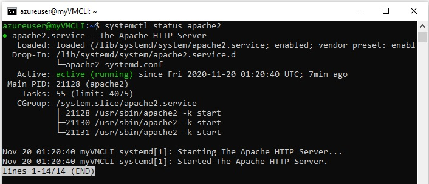
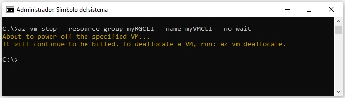
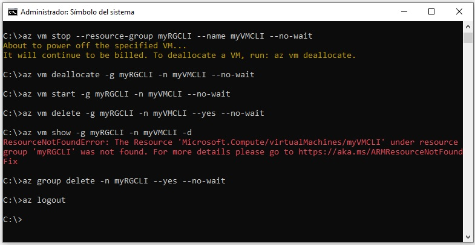

## Creacion de la maquina virtual en Azure ClI

### Conectarse desde Azure Cli A Azure

1. **Nombres y apellidos:** José René Fuentes Cortez
2. **Fecha:** 20 de Noviembre 2020.
3. **Resumen de la Creación de la máquina virtual en Azure CLI:** 
    -  Esta tarea tiene como objetivo la creación de una máquina virtual utilizando Azure CLI.


4. **Dificultad o problemas presentados y como se resolvieron:** Ninguna.

**NOTA**: Si no hay descripcion de problemas o dificultades, y al yo descargar el código para realizar la comprobacion y el código no funcionar, el resultado de la califaciación del laboratorio será afectado.

---
### 1. Haciendo login atravez de la línea de Comando.

```
az login
```

- La representación visual a la respuesta del último ejercicio se muestra en la siguiente imagen:

 


### 2. Creando un grupo de recursos

```
az group create -l EastUS -n myRGCLI 
```

- La representación visual a la respuesta del último ejercicio se muestra en la siguiente imagen:

 

- La representación visual a la respuesta del último ejercicio en el portal de Azure tal y como se muestra en la siguiente imagen:

 


### 3. Creando una máquina virtual Linux

```
az vm create ^
 --name myVMCLI ^
 --resource-group myRGCLI ^
 --image UbuntuLTS ^
 --location EastUS ^
 --admin-username azureuser ^
 --admin-password Pa$$w0rd1234 ^
 --no-wait
```

- La representación visual a la respuesta del último ejercicio se muestra en la siguiente imagen:

 

- La representación visual a la respuesta del último ejercicio en el portal de Azure tal y como se muestra en la siguiente imagen:

 

Conectarse a la máquina Virtual de Linux

```
ssh azureuser@52.142.58.75
Nota: Dar que si en la creación del certificado SSH
```
- La representación visual a la respuesta del último ejercicio se muestra en la siguiente imagen:

 


1 - Actualizar en Linux

```
sudo apt-get update
```
- La representación visual a la respuesta del último ejercicio se muestra en la siguiente imagen:

 


2 - Hacer el upgrade

```
sudo apt upgrade
```

- La representación visual a la respuesta del último ejercicio se muestra en la siguiente imagen:

 


3 - Instalar un servidor web

```
sudo apt install -y apache2 apache2-utils
```


- La representación visual a la respuesta del último ejercicio se muestra en la siguiente imagen:

 

4 - Vemos el estatus de Apache

```
systemctl status apache2
```

- La representación visual a la respuesta del último ejercicio se muestra en la siguiente imagen:

 

5 - Ponemos un mensaje en nuestra página de Apache

```
cd /var/www/html
```

- La representación visual a la respuesta del último ejercicio se muestra en la siguiente imagen:

 


6 - Poner una nota en la página index.html

```
sudo vi index.html <ENTER>
<ESC> : 198 <ENTER> // irme a la linea 198 que es donde esta el mensaje de index.html
<i> PONER EL MENSAJE <ESC>
: x <ENTER>

```

- La representación visual a la respuesta del último ejercicio se muestra en la siguiente imagen:

 

- La representación visual a la respuesta del último ejercicio se muestra en la siguiente imagen:

 

7 - Salir del SSH

```
exit <ENTER>
```

**Nota:**

El puerto 80 deberá ser abierto desde NSG.

Destination PortRanges: 80

Name: Port_80


- La representación visual a la respuesta del último ejercicio se muestra en la siguiente imagen:

 

Probariamos que llegamos a la maquina virtual: con la IP desde cualquier navegador.


## Parar y "deallocate" la máquina virtual

```
az vm stop --resource-group myRGCLI --name myVMCLI --no-wait
```

- La representación visual a la respuesta del último ejercicio se muestra en la siguiente imagen:

 

```
az vm deallocate -g myRGCLI -n myVMCLI --no-wait
```


- La representación visual a la respuesta del último ejercicio se muestra en la siguiente imagen:

 

## Iniciar la máquina virtual

```
az vm start -g myRGCLI -n myVMCLI --no-wait
```


- La representación visual a la respuesta del último ejercicio se muestra en la siguiente imagen:

 

## Borrar la máquina virtual

```
az vm delete -g myRGCLI -n myVMCLI --yes --no-wait
```


- La representación visual a la respuesta del último ejercicio se muestra en la siguiente imagen:

 

### Mostrar informacion de la máquina virtual

```
az vm show -g myRGCLI -n myVMCLI -d
```


- La representación visual a la respuesta del último ejercicio se muestra en la siguiente imagen:

 

Borrar el grupo de recursos

```
az group delete -n myRGCLI  --yes --no-wait
```

- La representación visual a la respuesta del último ejercicio se muestra en la siguiente imagen:

 

## Desconectamos de Azure

```
az logout
```

- La representación visual a la respuesta del último ejercicio se muestra en la siguiente imagen:

 

Mas información:

[Manage Linux or Windows virtual machines.](https://docs.microsoft.com/en-us/cli/azure/vm?view=azure-cli-latest)

